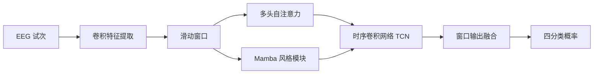

# EEG ATCNet + Mamba

**运动想象脑电分类 · ATCNet 基线复现 · Mamba 状态空间模块探索**

[](https://github.com/CuiLikun/BCI-Mamba-Versio/actions/workflows/tests.yml)
[](LICENSE)

基于 TensorFlow / Keras，使用 **BCI Competition IV-2a** 数据集开展受试者内、四分类运动想象实验。本项目从 ATCNet 基线出发，探索以 Mamba 风格模块替换注意力模块，并提供统一的数据划分、训练、模型选择和评估流程。

[快速开始](#快速开始) · [模型结构](#模型结构) · [实验结果](#实验结果) · [实验指南](docs/EXPERIMENTS.md) · [历史归档](historical/README.md)

## 项目概览

| 项目 | 说明 |
| --- | --- |
| 分类任务 | 左手、右手、脚、舌头运动想象 |
| 数据范围 | BCI IV-2a：9 位受试者、22 个 EEG 通道 |
| 输入形式 | 每试次 1125 个采样点，模型输入 `(batch, 1, 22, 1125)` |
| 评估方式 | 训练会话 T 划分训练 / 验证集，独立会话 E 用于最终测试 |
| 评价指标 | Accuracy、Cohen’s Kappa、混淆矩阵 |
| 已验证环境 | Python 3.12、TensorFlow 2.16.2、Keras 3.4.1；Windows / Linux CPU 测试 |

- **统一对比入口**：通过参数切换 ATCNet、时间轴 Mamba 与特征轴 Mamba。
- **可追溯的实验记录**：保存数据指纹、划分索引、标准化参数、训练历史与权重。
- **隔离的模型选择流程**：训练子集拟合标准化参数，验证损失决定模型选择。
- **完整的历史资料**：保留原课程实验的结果、图表、权重及代码历史。

## 快速开始

### 1. 获取代码与安装依赖

```bash
git clone https://github.com/CuiLikun/BCI-Mamba-Versio.git
cd BCI-Mamba-Versio
python -m venv .venv
```

激活虚拟环境，按操作系统选择一条命令：

```powershell
# Windows PowerShell
.\.venv\Scripts\Activate.ps1
```

```bash
# Linux / macOS
source .venv/bin/activate
```

```bash
python -m pip install -r requirements.txt
```

依赖版本见 [requirements.txt](requirements.txt)。上述 macOS 命令仅说明虚拟环境激活方式，当前测试记录覆盖 Windows 与 Linux。

### 2. 准备数据

将 **BCI IV-2a / BNCI 2014-001 的 MATLAB 版本**放入 `data/`，包含以下文件：

```text
data/
├── A01T.mat       # 受试者 1：训练会话
├── A01E.mat       # 受试者 1：测试会话
├── ...
├── A09T.mat
└── A09E.mat
```

解析器读取带有 `data` 结构的 MAT 文件；GDF 文件不能直接用于此入口。数据需自行获取，本仓库不分发 EEG 数据。详细格式和预处理约定见[实验指南](docs/EXPERIMENTS.md#数据与预处理)。

### 3. 先验证单个受试者的流程

```bash
python experiment.py train --model atcnet --data-dir data --output runs/atcnet-smoke --subjects 1 --epochs 1
```

该命令需要 `A01T.mat` 和 `A01E.mat`，完成一轮训练后自动评估，用于确认流程可运行。**一轮训练的结果不代表模型最终性能。** 每次训练须使用新的输出目录。

### 4. 运行模型对比

```bash
python experiment.py train --model atcnet --data-dir data --output runs/atcnet --seeds 1 2 3
python experiment.py train --model mamba --data-dir data --output runs/mamba --seeds 1 2 3
```

默认处理全部 9 位受试者，每次最多训练 500 轮。两个命令使用相同的划分与种子集合；更多参数见[命令行参数](docs/EXPERIMENTS.md#命令行参数)。

### 5. 查看或重新评估结果

结果写入各输出目录的 `metrics.json`。独立评估会读取已保存的模型选择记录和标准化参数：

```bash
python experiment.py evaluate --data-dir data --output runs/atcnet
```

该命令重新计算并更新 `metrics.json`，不会重新训练。输出文件的含义见[实验产物](docs/EXPERIMENTS.md#实验产物)。

## 模型结构



图中两条分支是可选配置，每次实验使用其中一种。

| `--model` | 窗口内模块 | 维度语义 | 用途 |
| --- | --- | --- | --- |
| `atcnet` | 多头自注意力 | 时间序列 | ATCNet 基线 |
| `mamba` | Mamba 风格状态空间模块 | 沿时间轴扫描，输入 `(batch, time, features)` | 时间序列建模实验 |
| `mamba-channel` | Mamba 风格状态空间模块 | 沿卷积特征轴扫描 | 保留旧实现的轴语义 |

Mamba 模块采用 TensorFlow `tf.scan` 与 `same` 卷积，面向离线试次分类。它是探索性实现，未使用官方融合 CUDA 内核，也不具备严格因果流式推理语义。时间轴版与旧版权重不能互换。

## 实验结果

以下数值来自归档中的原始 README，用于记录课程实验进展：

| 历史实验 | 平均 Accuracy | 平均 Kappa | 原始记录 |
| --- | ---: | ---: | --- |
| ATCNet | 77.16% | 0.695 | [逐受试者结果](historical/atcnet/README.original.md) |
| Mamba 仓库旧实验 | 73.69% | 0.649 | [逐受试者结果](historical/mamba/README.original.md) |

> **新版协议的完整数据集结果待补充。** 历史成绩未经当前流程复测，不能用于证明 Mamba 优于或劣于 ATCNet。旧实验的评估问题、结果来源和完整性清单见[历史归档](historical/README.md)。

## 目录导航

| 路径 | 内容 |
| --- | --- |
| [experiment.py](experiment.py) | 统一训练、验证选择与测试入口 |
| [models.py](models.py) | ATCNet 主体结构及其他遗留模型 |
| [mamba.py](mamba.py) | Mamba 风格状态空间模块 |
| [attention_models.py](attention_models.py) | 注意力模块及 Mamba 接入 |
| [preprocess.py](preprocess.py) | 数据读取与预处理辅助函数 |
| [tests/](tests/) | 数据隔离、模型与训练流程测试 |
| [docs/EXPERIMENTS.md](docs/EXPERIMENTS.md) | 参数、评估协议、输出说明与常见问题 |
| [historical/](historical/) | 原始结果、图表、权重与来源清单 |

## 开发与验证

```bash
python -m pip install -r requirements-dev.txt
python -m pytest -q
```

自动测试覆盖数据隔离、验证集选择、默认受试者范围、三种模型的前向计算与梯度、权重恢复、自定义层序列化，以及合成数据上的训练 / 独立评估。GitHub Actions 在 Linux CPU 上运行，无需下载真实 EEG 数据。

## 参考与许可

ATCNet 基于 Hamdi Altaheri、Ghulam Muhammad 与 Mansour Alsulaiman 的原始工作：*Physics-informed attention temporal convolutional network for EEG-based motor imagery classification*，IEEE Transactions on Industrial Informatics。[论文 DOI](https://doi.org/10.1109/TII.2022.3197419)。

Mamba 模块参考 Albert Gu 与 Tri Dao 的 *Mamba: Linear-Time Sequence Modeling with Selective State Spaces*，本仓库为 TensorFlow 探索性实现。

本项目的工作包括基线实验整理、Mamba 变体与统一评估流程。原代码的 King Saud University 版权声明予以保留，代码采用 [Apache License 2.0](LICENSE)。
