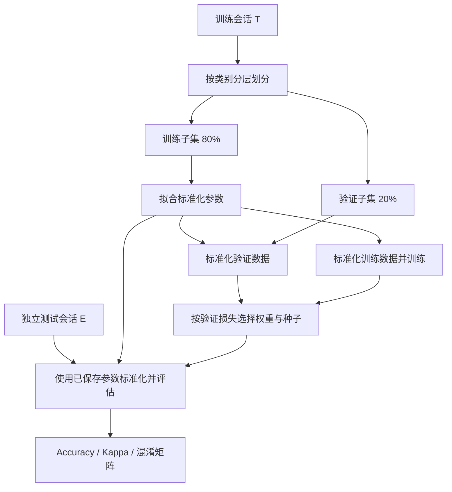

# 实验指南

[返回项目首页](../README.md) · [历史实验归档](../historical/README.md)

本文对应根目录 [experiment.py](../experiment.py) 的统一入口，适用于 **BCI Competition IV-2a 的受试者内评估**。

## 数据与预处理

每位受试者需要 `AxxT.mat` 与 `AxxE.mat` 两个文件，`xx` 为 `01` 至 `09`。`T` 是训练会话，`E` 是独立测试会话。训练入口会先检查所选受试者的两个文件是否存在。

解析器使用 MAT 文件中的 `data` 结构，保留原实现的以下约定：

- 使用 22 个 EEG 通道，采样率 250 Hz。
- 从原试次窗口中截取 1.5–6 秒，得到 1125 个采样点。
- 默认保留带伪迹标记的试次。
- 标签转为 `0`–`3`，依次对应左手、右手、脚、舌头。
- 模型输入维度为 `(batch, 1, 22, 1125)`。

统一入口不直接读取 GDF，也未接入 HGD / CS2R。仓库中的相关辅助代码属于遗留实现。

## 命令行参数

查看帮助：

```bash
python experiment.py train --help
python experiment.py evaluate --help
```

### 训练

| 参数 | 默认值 | 说明 |
| --- | --- | --- |
| `--data-dir` | 必填 | MAT 文件所在目录 |
| `--output` | 必填 | 本次实验的新输出目录；已存在则拒绝写入 |
| `--model` | `atcnet` | `atcnet`、`mamba` 或 `mamba-channel` |
| `--subjects` | `1 2 3 4 5 6 7 8 9` | 受试者编号，不重复 |
| `--seeds` | `1` | 训练随机种子列表，不重复，范围 `[0, 2**32)` |
| `--split-seed` | `42` | 训练 / 验证划分种子 |
| `--val-fraction` | `0.2` | 验证集比例，取值在 0 与 1 之间 |
| `--epochs` | `500` | 每个种子的最大训练轮数 |
| `--patience` | `100` | 验证损失未改善时的早停耐心轮数 |
| `--batch-size` | `64` | 训练与预测的批大小 |
| `--lr` | `0.001` | Adam 初始学习率 |

只训练受试者 1、2 的特征轴 Mamba：

```bash
python experiment.py train --model mamba-channel --data-dir data --output runs/channel-s01-s02 --subjects 1 2 --seeds 1 2 3
```

输出路径包含空格时，用引号包住路径。对比不同模型时，保持数据、受试者、划分种子、训练种子集合和训练预算一致，只改变模型参数及输出目录。

### 独立评估

```bash
python experiment.py evaluate --data-dir data --output runs/channel-s01-s02
```

评估入口只有 `--data-dir` 和 `--output` 两个必填参数。模型、受试者及批大小从已有 `config.json` 读取，所选权重从 `selection.json` 读取。评估会复用保存的标准化参数，核对 E 会话文件的 SHA-256，并更新 `metrics.json`。

`main_TrainTest.py` 和 `main_TrainValTest.py` 是兼容入口，接受相同的子命令与参数；不再保留两套不同的训练协议。

## 评估协议



1. 每位受试者单独划分训练会话。不同训练种子共用同一划分。
2. 标准化均值与标准差仅沿训练试次维度计算，即每个通道、每个时间点各有一组参数。
3. 每个种子保存验证损失最低的权重；再从所有种子中选取验证损失最低的一次，并列时保留列表中较早的一次。
4. 所有受试者完成模型选择后，评估独立 E 会话。测试成绩不参与模型选择。

训练过程中使用早停和基于验证损失的学习率调整。当前不支持断点续训，也未强制跨设备确定性；固定种子不等同于跨硬件逐位复现。

## 实验产物

以单个受试者、训练种子 `1` 为例：

```text
runs/atcnet/
├── config.json
├── selection.json
├── metrics.json
└── subject-01/
    ├── preprocessing.npz
    ├── seed-1.history.json
    └── seed-1.weights.h5
```

| 文件 | 内容与用途 |
| --- | --- |
| `config.json` | 命令行配置、TensorFlow / Keras 版本、协议标识和数据文件指纹 |
| `selection.json` | 各受试者每个种子的最佳验证损失、权重路径与最终选择 |
| `preprocessing.npz` | 训练 / 验证索引及标准化的 `mean`、`scale` |
| `seed-*.history.json` | 每轮训练与验证的损失、准确率等记录 |
| `seed-*.weights.h5` | 对应种子的最佳验证权重 |
| `metrics.json` | 所选模型在各受试者上的测试指标及跨受试者均值 |

`metrics.json` 中 Accuracy 为 `0`–`1` 的比例，乘以 100 后为百分比。混淆矩阵保存原始计数，行是真实类别、列是预测类别，类别顺序为左手、右手、脚、舌头。`mean_accuracy` 和 `mean_kappa` 是所选受试者指标的算术平均，不是所有种子的平均。

训练中断时输出目录可能已经存在，且部分文件尚未完成。应保留它用于排查，重跑时指定新的目录；独立评估会拒绝受试者选择记录不完整的实验。

## 常见问题

| 现象 | 处理方式 |
| --- | --- |
| `Missing BCI IV-2a MAT files` | 检查 `--data-dir`、两位数文件名，以及所选受试者的 T / E 文件是否齐全 |
| 提示输出目录已存在 | 换用新的 `--output`；当前入口不覆盖已有实验 |
| MAT 读取时缺少 `data` 结构 | 确认使用解析器要求的 MATLAB 版本，而非 GDF 或其他封装格式 |
| `Dataset changed` | 评估文件与训练记录的指纹不同；恢复原测试文件，或为新数据重新建立实验 |
| `Incomplete experiment` | 尚有受试者未完成训练或模型选择；查看原训练错误并使用新目录重新运行 |
| 历史 `.h5` 权重无法加载 | 查看归档对应的原代码与环境；旧版权重不属于新版 CLI 的实验产物 |
| 测试通过但没有新版 EEG 成绩 | 自动测试使用合成数据；完整成绩需要真实 EEG 数据训练与评估 |

## 测试与复现范围

```bash
python -m pip install -r requirements-dev.txt
python -m pytest -q
```

测试验证数据隔离、模型选择和计算流程，不评价真实 EEG 分类性能。当前依赖固定了主要库的版本；实验记录保存 TensorFlow / Keras 版本和数据指纹，但未记录所有传递依赖及硬件信息。正式汇报时建议同时保存环境信息、代码提交号和完整运行配置。
